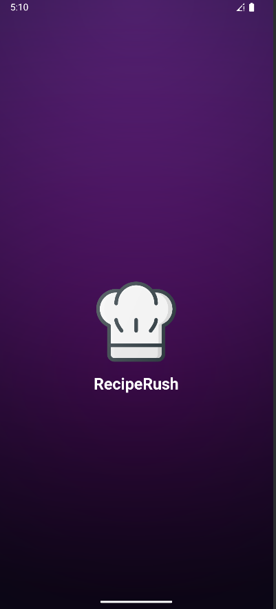
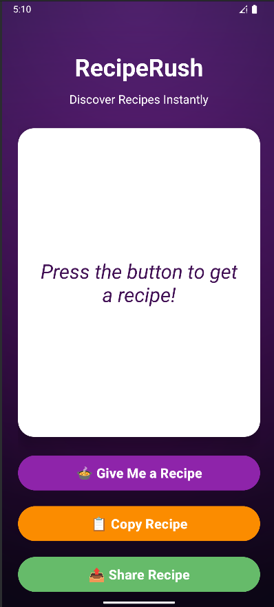
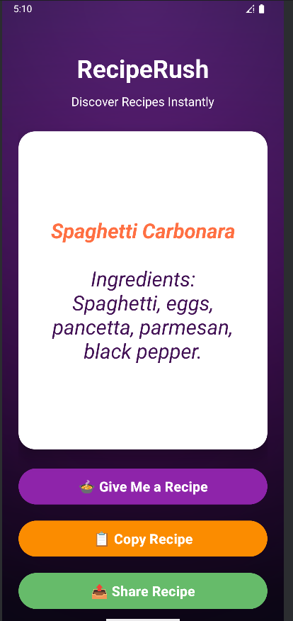
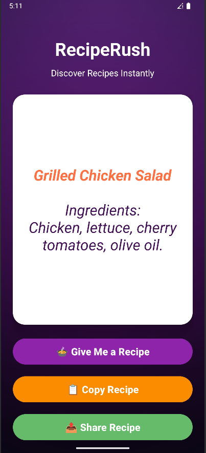

# RecipeRush 🍲

**Short Description:** Discover recipes instantly with one tap!  

**Long Description:**  
RecipeRush is your quick and easy guide to discover delicious recipes. Press the “Give Me a Recipe” button to generate a random dish with its ingredients. You can **copy** the recipe to your clipboard or **share** it with friends instantly. Recipes are displayed in a clean card style, with the dish name highlighted and ingredients clearly listed. Perfect for home cooks, students, and anyone who loves food!  

**Features:**  
- Random recipe generator with a single tap  
- Structured display: recipe title and ingredients  
- Copy recipe to clipboard  
- Share recipe via any app  
- Scrollable recipe card for long recipes  

**Screenshots:**  

| Screenshot 1 | Screenshot 2 |
|--------------|--------------|
|  |  |

| Screenshot 3 | Screenshot 4 |
|--------------|--------------|
|  |  |

**Author:** MD Rohan Islam  
**Email:** rusho.rohan@gmail.com  
**GitHub:** [github.com/rohan-rusho](https://github.com/rohan-rusho)
